+++
title = "Prove That Meridians Are Geodesics With LLMs"
date = 2025-06-27
draft = false
tags = ["differential geometry", "meridian", "geodesic", "covariant parallel", "chatgpt", "claude"]
+++

**TL;DR:**

- I tried to prove that meridians on a surface of revolution are always geodesics, but my calculations suggested otherwise unless a certain condition was met.
- I consulted ChatGPT and Claude; both initially gave confusing or circular reasoning, but Claude provided a clue that led me to the answer.
- The key insight: the geodesic equation requires the curve to be parametrized with constant speed (affine parametrization).
- Parallel transport preserves the length of the tangent vector, so the tangent must have constant speed along a geodesic.
- The collaborative exploration with LLMs brought more satisfaction than just getting the answer directly.

I've learned bits of differential geometry over the years, and I always use Theodore Shifrin's notes, *Differential Geometry: A First Course in Curves and Surfaces*, as my textbook. Recently, I decided to pick it back up just for fun.

In Chapter 2, after reading about Clairaut's relation and trying to get an intuitive picture of it, it occurred to me that the meridians of a surface of revolution should always be geodesics. This makes sense because the "terrain" is symmetrical about the meridian, so if you are walking along the meridian, you are not going either left or right, but straight ahead. But to show this formally, we need to use the mathematical definition of a geodesic, and I'll use the one from the notes:

> **Definition.** We say a parametrized curve $\alpha$ in a surface $M$ is a geodesic if its tangent vector is parallel along the curve, 
i.e., if $\nabla_{\alpha^\prime}\alpha^\prime=0$.

To add some brief explanation: $\nabla$ is the covariant derivative, defined as the projection of the directional derivative onto the tangent space:
$$
    \nabla_{\alpha^\prime}\alpha^\prime = \big(D_{\alpha^\prime}\alpha^\prime\big)^\parallel
$$
The definition is essentially saying that geodesics are parallel transport of their tangent vectors. The geometrical relationships among the relevant quantities are summarized in the following diagram:

    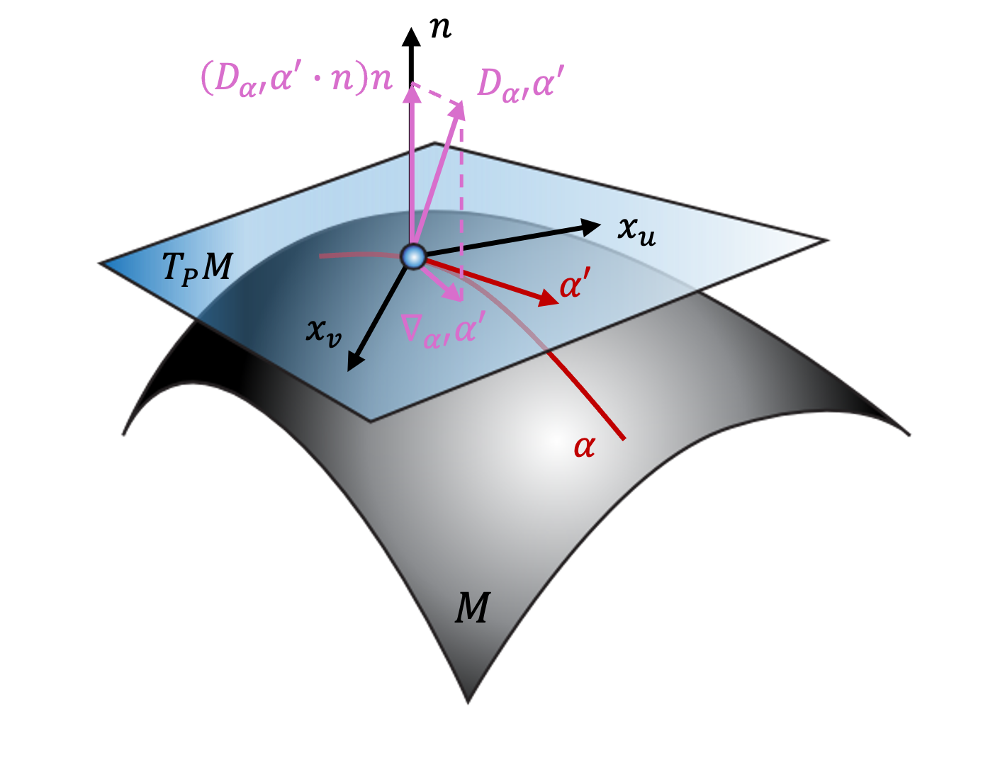

Then the recipe for the proof is quite straightforward:
- A parametrization of the surface of revolution $x(u, v)$.
- Calculate $x_u$ and $x_v$ as bases of the tangent plane.
- A parametrization of the meridian $\alpha$ on the surface, as a function of $u$ and/or $v$.
- Calculate the directional derivative $D_{\alpha^\prime}\alpha^\prime$.
- Calculate the covariant derivative $\nabla_{\alpha^\prime}\alpha^\prime$ by projecting $D_{\alpha^\prime}\alpha^\prime$ onto the tangent plane.
- Show that $\nabla_{\alpha^\prime}\alpha^\prime$ is always 0.

The second-to-last step may sound simple, but it usually involves Christoffel symbols, which can be quite a hassle. Instead, I decided to adopt a different but equivalent approach to make the calculations easier:
- Calculate the unit surface normal from $x_u$ and $x_v$.
- Calculate the normal component of $D_{\alpha^\prime}\alpha^\prime$.
- Show that the length of the normal component equals $\lVert D_{\alpha^\prime}\alpha^\prime \rVert$.

So, the first step is to parametrize an arbitrary surface of revolution as:
$$
    x(u, v) = \big(f(u)\cos v, f(u)\sin v, g(u)\big)
$$
where $f$ and $g$ are two arbitrary functions describing the curve $\beta$ that generates the surface by revolution, and $v$ is the angle of rotation:

    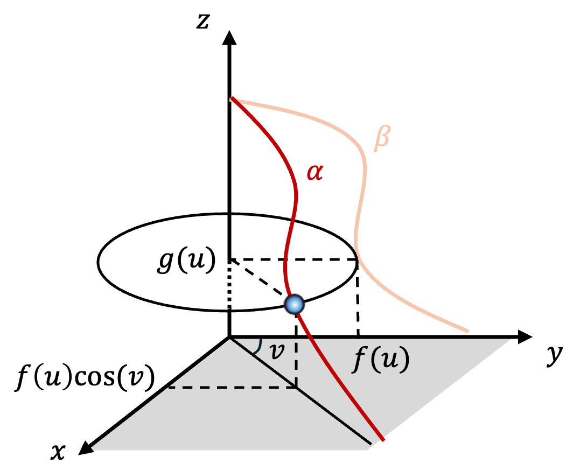

Then, a meridian $\alpha$ is simply a $u$-curve, namely, a curve that's parametrized only by $u$, at a constant $v=v_0$:
$$
    \alpha(u) = \big(f(u)\cos v_0, f(u)\sin v_0, g(u)\big)
$$
To obtain the surface normal, I first calculate $x_u$ and $x_v$ to get the two basis vectors for the tangent space:
$$
\begin{align\*}
    x_u &= \big(f^\prime(u)\cos v, f^\prime(u)\sin v, g^\prime(u)\big) \\\\\[1.5ex]
    x_v &= \big(-f(u)\sin v, f(u)\cos v, 0\big)
\end{align\*}
$$
Then, take the cross product:
$$
\begin{align\*}
    \tilde n &= x_u \times x_v \\\\\\
             &= \begin{vmatrix}
                    i & j & k \\\\\\
                    f^\prime(u)\cos v & f^\prime(u)\sin v & g^\prime(u) \\\\\\
                    -f(u)\sin v & f(u)\cos v & 0 \\\\\[2ex]
                \end{vmatrix} \\\\\\
             &= \big(-fg^\prime\cos v, -fg^\prime\sin v, f^\prime f\cos^2v + f^\prime f\sin^2v\big) \\\\\\
             &= f(-g^\prime\cos v, -g^\prime\sin v, f^\prime)
\end{align\*}
$$
The normalized surface normal is therefore:
$$
\begin{align\*}
    n &= \frac{\tilde n}{\lVert \tilde n \rVert} 
      = \frac{f(-g^\prime\cos v, -g^\prime\sin v, f^\prime)}{\sqrt{f^2(g^{\prime 2} + f^{\prime 2})}} \\\\\[3ex]
      &= \frac{(-g^\prime\cos v, -g^\prime\sin v, f^\prime)}{\sqrt{(g^{\prime 2} + f^{\prime 2})}}
\end{align\*}
$$

Then, I proceed to calculate the directional derivative of the tangent vector of the meridian in the direction of the tangent vector: 
$$
    D_{\alpha^\prime(u)} \alpha^\prime(u) = \alpha^{\prime\prime}(u) 
    = \big(f^{\prime\prime}\cos v_0, f^{\prime\prime}\sin v_0, g^{\prime\prime}\big)
$$
To show that $\nabla_{\alpha^\prime(u)} \alpha^\prime(u) = 0$ is to show that the above directional derivative has only 
a normal component, which is to say that $\lVert D_{\alpha^\prime(u)} \alpha^\prime(u)\rVert = D_{\alpha^\prime(u)} \alpha^\prime(u)\cdot n$. Both sides can be easily computed from the above results:
$$
\begin{align\*}
    \lVert D_{\alpha^\prime(u)} \alpha^\prime(u)\rVert &= \lVert\alpha^{\prime\prime}(u)\rVert = 
    \sqrt{f^{\prime\prime 2}\cos^2 v_0 + f^{\prime\prime 2}\sin^2 v_0 + g^{\prime\prime 2}} = 
    \sqrt{f^{\prime\prime 2} + g^{\prime\prime 2}}\\\\\[3ex]
    D_{\alpha^\prime(u)} \alpha^\prime(u)\cdot n &= 
    \frac{-f^{\prime\prime}g^\prime\cos^2 v - f^{\prime\prime}g^\prime\sin^2 v + f^\prime g^{\prime\prime}}{\sqrt{g^{\prime 2} + f^{\prime 2}}} = \frac{f^\prime g^{\prime\prime} - f^{\prime\prime}g^\prime}{\sqrt{g^{\prime 2} + f^{\prime 2}}}
\end{align\*}
$$
Now I'm in trouble, because clearly they are not always equal! Meridians should *always* be geodesics, but now the calculations 
say that $f(u)$ and $g(u)$ need to satisfy some condition for this to be the case. Naturally, I turned to ChatGPT for answers. First, 
under my guidance, ChatGPT 4o verified my calculations and the issue:

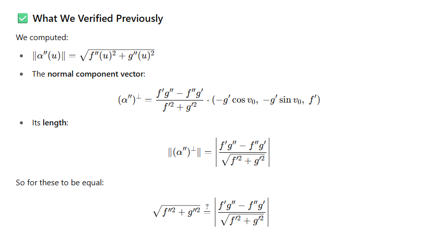

To resolve the apparent paradox, ChatGPT said:

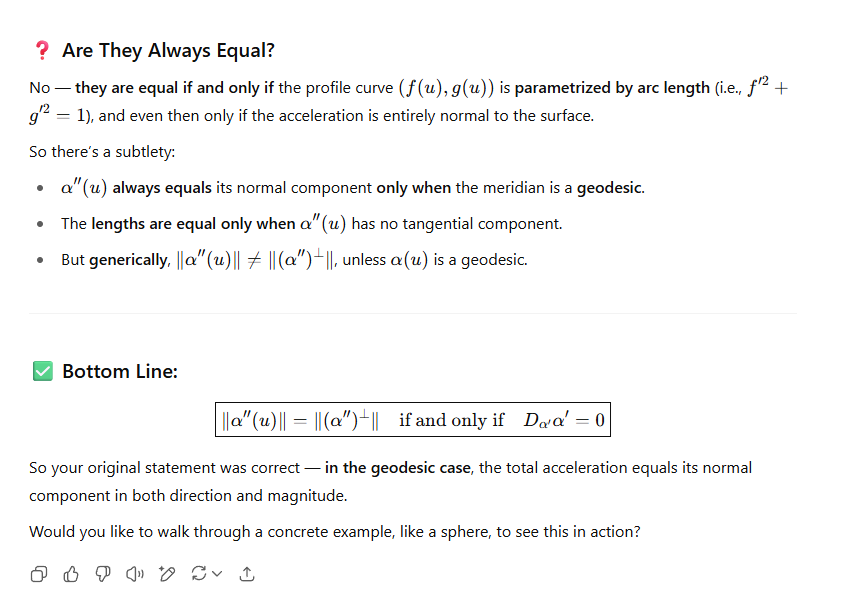

ChatGPT actually made a valid point about arclength parametrization, which I will address later, but the three bullet points were utterly confusing to me. You can't say that "$\alpha^{\prime\prime}(u)$ always equals its normal component only when the meridian is a geodesic," because (1) the claim is that meridians are *always* geodesics, and (2) we are trying to prove the claim by showing that $\alpha^{\prime\prime}$ always equals its normal component. I pointed out the confusing logic, but ChatGPT seemed to be stuck in some loop, giving more and more confusing reasons, like this:

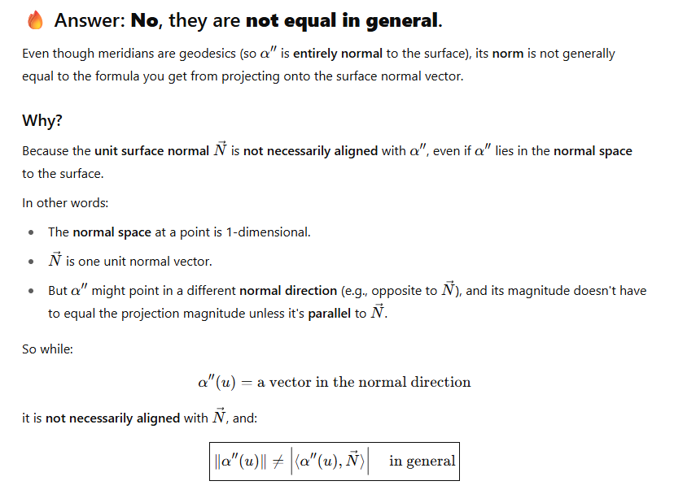

There's simply no way that $\alpha^{\prime\prime}$ lives in the 1D normal space and doesn't align with the unit surface normal. For some reason, I didn't think of ChatGPT o4-mini, which is much better at reasoning, but instead I turned to Claude Sonnet 4, since many people have said good things about it. At first, Claude tried to show that the covariant derivative is zero:

    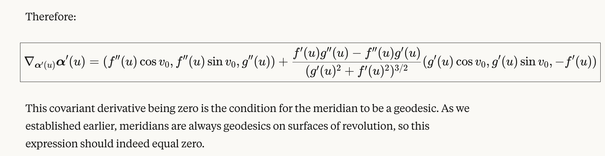

So it seemed to be using the same circular logic that ChatGPT used, that "the covariant derivative is zero because it should be zero for geodesics," which totally defeats the purpose of the proof. Here's how the conversation unfolded after I pointed out the obviously flawed reasoning:

    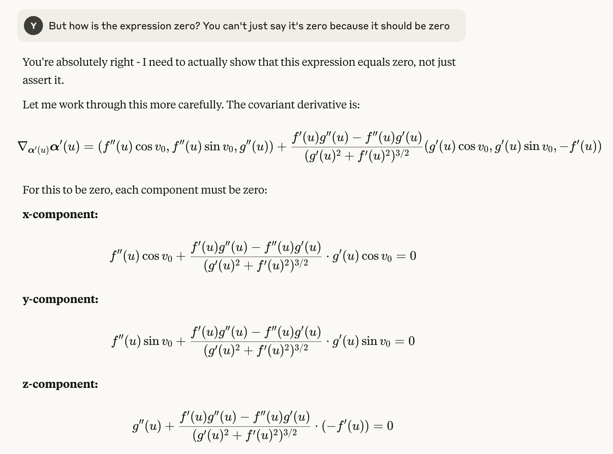

    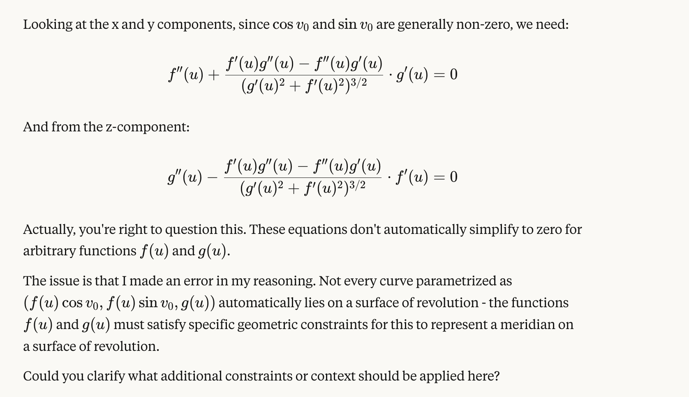

    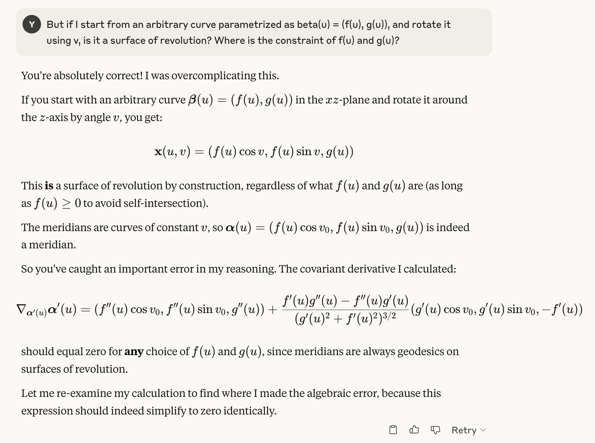

    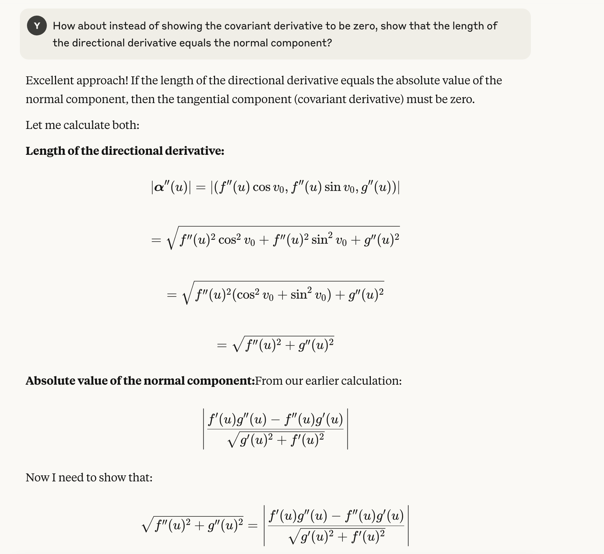

    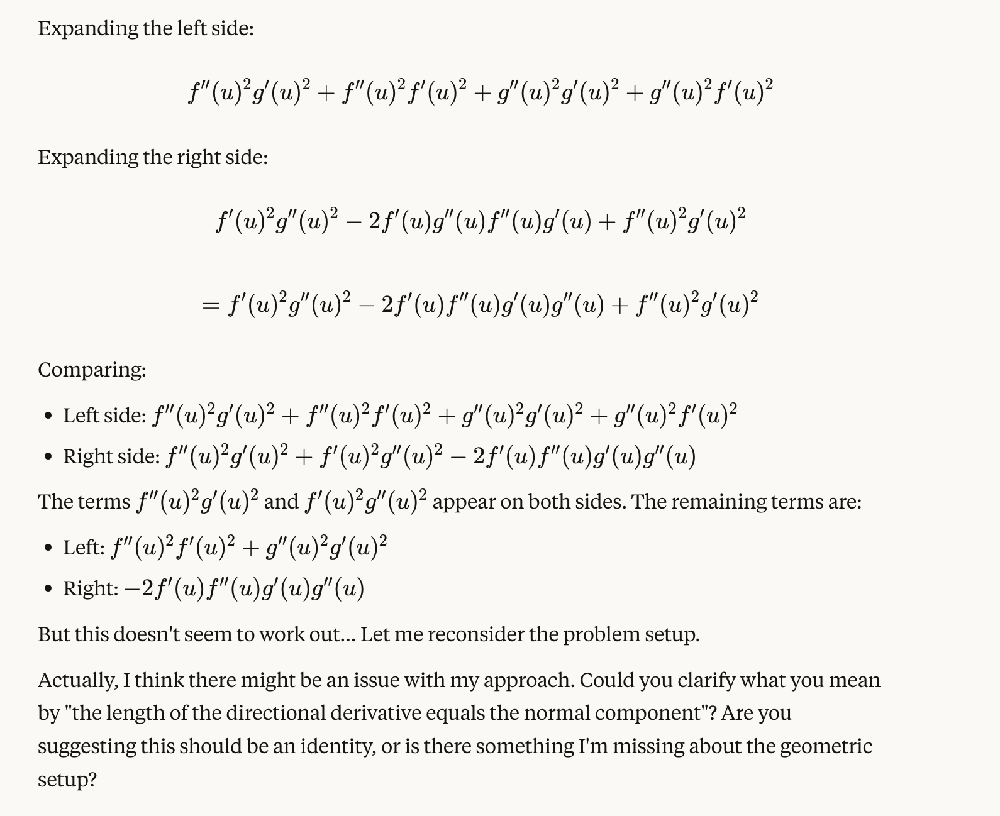

In short, Claude realized that there was an inconsistency somewhere along the line, and it admitted that it didn't know exactly what it was. Personally, I found this conversation more pleasant than the one I had with ChatGPT 4o, but this is a topic for later. The turning point happened in the next exchange:

    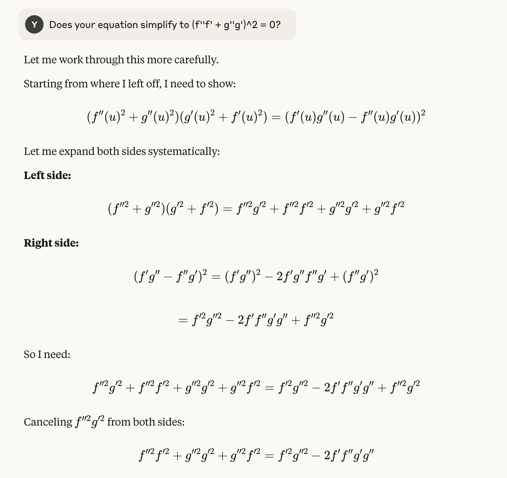

    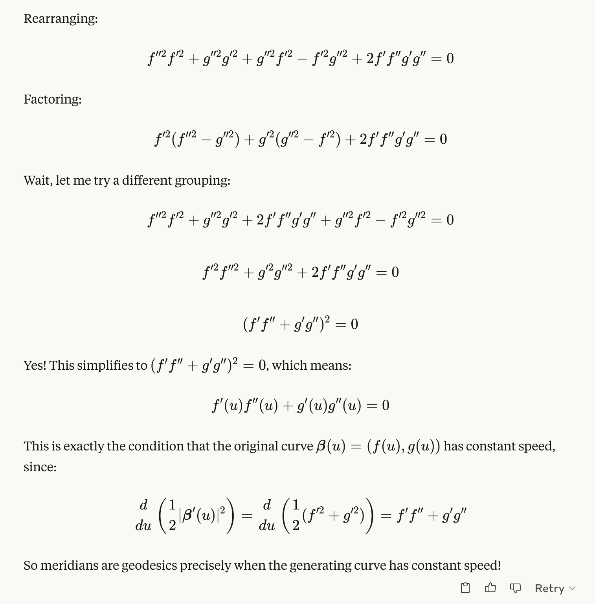

Claude insightfully pointed out that the equation actually implied that the parametrization should have constant speed, which is the mysterious condition we were both missing! I knew this must be the answer, but it's still not completely satisfying for me just yet. For one, nowhere in the above **definition** does it mention that the curve should be arclength or affine parametrized. Second, if, geometrically speaking, a meridian is always a geodesic, shouldn't it satisfy the definition of a geodesic no matter the parametrization? In response to my questions, Claude amusingly backed down from its conclusion and thought it had made some algebraic error:

    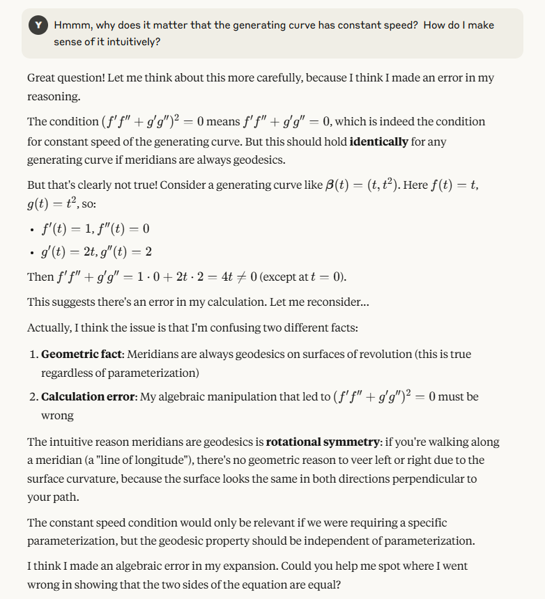

Since it seemed like Claude became confused again, I thought of ChatGPT o4-mini, which is better at reasoning. Indeed, it confirmed that the curve needs to be affine parametrized, i.e., have constant speed, and offered some additional insights:

    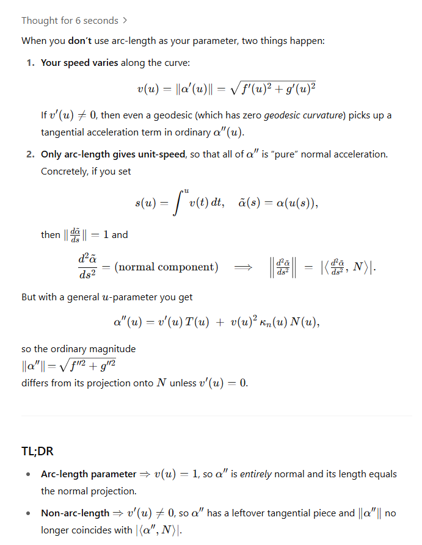

Now it started to make sense to me: parametrization not only controls the shape of the curve, but also how an object moves along the curve. The directional derivative of the tangent vector is the acceleration, so even along a geodesic it can have a tangential component if the object is accelerating! Furthermore, since parallel transport, defined by a vanished covariant derivative, is *length preserving*, the length of the tangent vector has to remain constant, which is exactly the condition Claude got from solving $\nabla_{\alpha^\prime}\alpha^\prime=0$. So, the **definition** is somewhat misleading, in that the tangent vector is not just *parallel* along the curve, but it's *parallel-transported*. Embarrassingly, after reading the notes a bit more carefully, I found the following text underneath the definition, only half a centimeter away:

> Recall that since parallel translation preserves lengths, $\alpha$ must have constant speed, although it may not be arclength-parametrized. In general, we refer to an unparametrized curve as a geodesic if its arclength parametrization is in fact a geodesic.

I explained what I "discovered" to Claude, and it nicely summarized everything:

    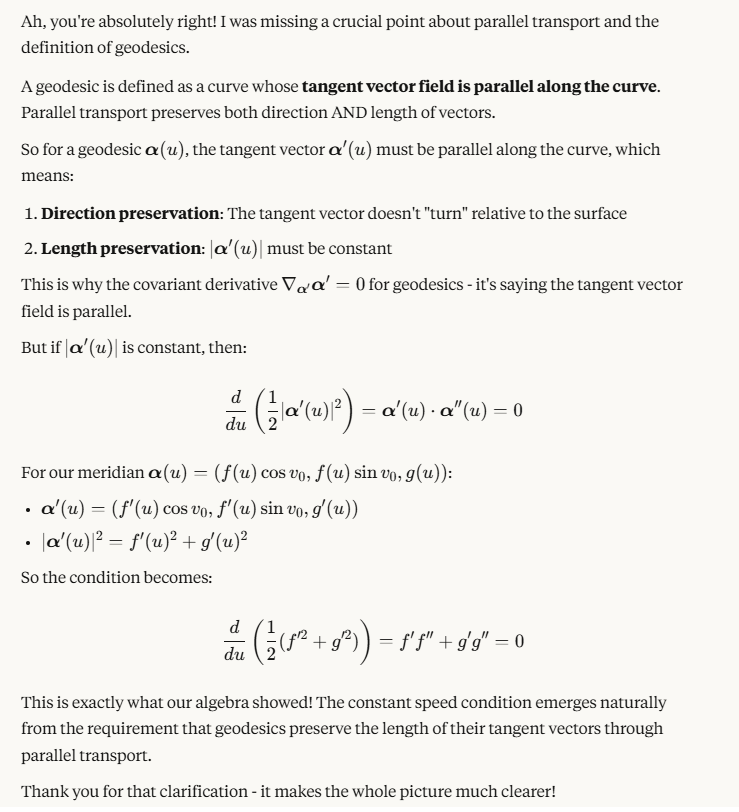

It is amazing to me how working out a simple proof led to a journey of discovering a missing part in my knowledge, which in the end also deepened my understanding of the relationship between geodesics and parallel transport. The fact that the constant speed condition emerges naturally from the parallel transport requirement really ties everything together elegantly. 

What's more amazing to me is the role of LLMs. ChatGPT 4o did mention arclength parametrization at first, but it didn't show this was the key to the puzzle, and instead gave me some hand-waving explanations. Claude failed to provide the answer too, and got the same confusion as I did, but still played the role of a "math buddy" exploring the problem with me. It noticed the algebraic connection of the equation to constant speed, which eventually became our "eureka!" moment. This experience of collaborative exploration brought more dopamine than the answer itself. Of course, if I had used ChatGPT o4-mini in the first place, I might have saved a few hours, but I think it would have been way less fun.